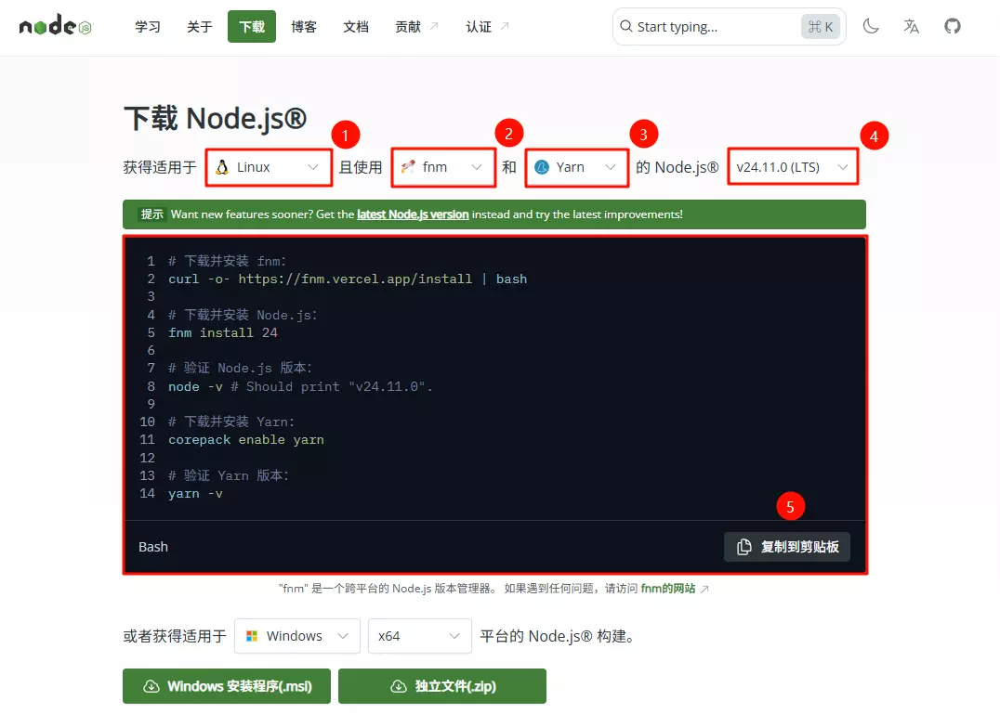
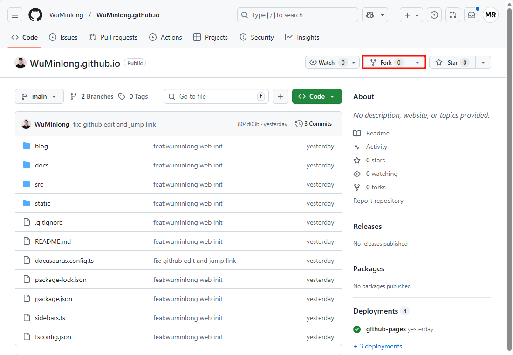
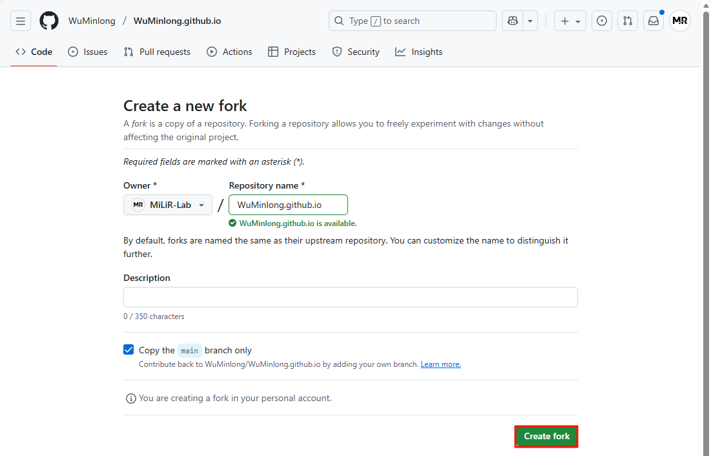
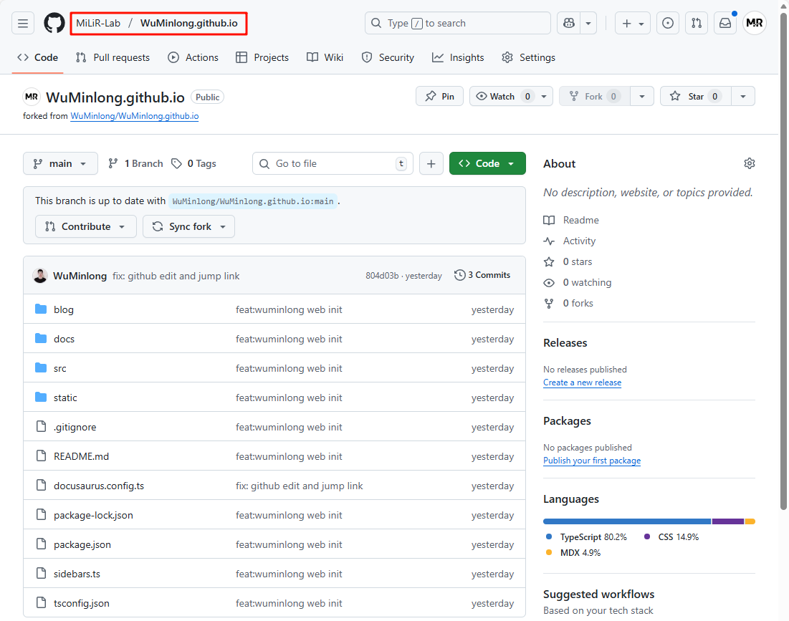

# 网站说明

- [个人网站](https://wuminlong.github.io/)
- [GitHub 仓库](https://github.com/WuMinlong/WuMinlong.github.io)

基于 Docusaurus 构建并部署到 GitHub Pages 的个人知识库！ 

## 环境部署

Docusaurus 是由一组 npm 包组成的，需要 Node.js 作为运行环境。

说明：推荐在 Ubuntu / macOS / Windows WSL 上搭建环境！

### 安装 Node.js

> 官网： [Node.js](https://nodejs.org/) 

访问 [Node.js® 下载页面](https://nodejs.org/zh-cn/download) ，根据自己系统的平台选择对应的版本进行安装。



- ① 选择系统对应的平台
- ② 选择 Node.js® 的版本管理工具
- ③ 选择 avaScript 包管理器（推荐 Yarn）
- ④ 选择 Node.js® 版本（推荐 LTS）
- ⑤ 复制安装 Node.js® 的命令

```bash
# 更新包列表
sudo apt update

# 安装 unzip
sudo apt install unzip

# 下载并安装 fnm：
curl -o- https://fnm.vercel.app/install | bash

# 使 fnm 生效
source ~/.bashrc

# 下载并安装 Node.js：
fnm install 24

# 验证 Node.js 版本：
node -v # Should print "v24.11.0".

# 下载并安装 Yarn:
corepack enable yarn

# 验证 Yarn 版本：
yarn -v
```

## 克隆 Fork 仓库

以 MiLiR-Lab 账号为例，介绍协同开发的流程。

### Fork 仓库

1. 点击仓库页面的 [Fork](https://github.com/WuMinlong/WuMinlong.github.io/fork) 选项



2. 点击 `Create fork` 选项创建 fork 仓库



3. 成功后，会跳转到 fork 仓库的页面



### 克隆 Fork 仓库

1. 生成 SSH 密钥

```bash
ssh-keygen -t ed25519 -C "xxx@163.com"
```

生成密钥后，会提示输入保存路径和密码，直接回车即可。

2. 查看 SSH 密钥

```bash
cat ~/.ssh/id_ed25519.pub
```

终端会输出类似如下的内容：

```
ssh-ed25519 AAAAC3NzaC1lZDI1NTE5AAAAIAGD2xSIIFEU4jraPVaI9sdoAa9WcQft8uJ0ZOoP1Tn1 xxx@163.com
```

3. 添加 SSH 密钥到 GitHub 账号

在 GitHub 账号的界面中，依次点击 `Settings` -> `SSH and GPG keys` -> `New SSH key`，将上一步输出的 SSH 密钥复制到 `Key` 选项中，点击 `Add SSH key` 选项即可。

4. 克隆 Fork 仓库

打开系统终端，输入以下命令克隆 Fork 仓库：

```bash
git clone git@github.com:MiLiR-Lab/WuMinlong.github.io.git
```

克隆成功后，终端会输出类似如下的内容：

```
Cloning into 'WuMinlong.github.io'...
remote: Enumerating objects: 62, done.
remote: Counting objects: 100% (62/62), done.
remote: Compressing objects: 100% (57/57), done.
remote: Total 62 (delta 4), reused 60 (delta 2), pack-reused 0 (from 0)
Receiving objects: 100% (62/62), 373.94 KiB | 358.00 KiB/s, done.
Resolving deltas: 100% (4/4), done.
```

## 本地运行部署

1. 进入克隆的仓库目录

```bash
cd WuMinlong.github.io
```

2. 安装依赖

```bash
yarn install
```

3. 运行开发服务器

```bash
yarn start
```

系统会自动打开浏览器并访问 http://localhost:3000/ 预览网站。

4. 构建生产版本

```bash
yarn build
```

5. 运行生产版本

```bash
yarn serve
```

系统会自动打开浏览器并访问 http://localhost:3000/ 预览网站。

## 修改仓库

若需要对仓库的内容进行修改，可以修改后提交到本地仓库，然后推送到 fork 仓库，最后将 fork 仓库的修改合并到原始仓库。

